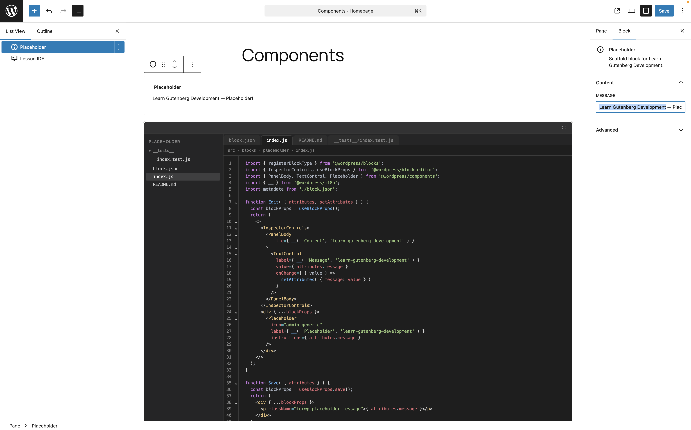

# Placeholder — learning block

## What this is

This is an example block in the **Learn Gutenberg Development** plugin (4WP.dev): 
a simple skeleton for experiments in the editor and for Gutenberg-focused lessons.

## Which block

- **Name:** `learn-gutenberg/placeholder`
- **Role:** starting point before more advanced blocks; 
shows the basic `edit` / `save` structure, attributes, and inspector.

## What we cover

- Registering the block with `registerBlockType`
- `useBlockProps` in the editor and in saved markup
- Attributes (for example, message text) and inspector 
UI (`InspectorControls`, `PanelBody`, `TextControl`)

Open the nearby files (`index.js`, `block.json`, tests) in the **Lesson IDE**
block on the front end or in the editor — same file tree and syntax highlighting.

## Screenshot

Placeholder block with **Lesson IDE** in the editor:

